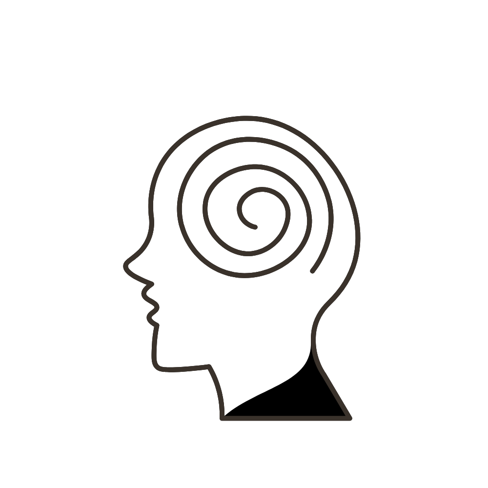

  

    <a href="#roadmap">Roadmap</a>
  • <a href="#techs">Tecnologias</a> 

---

<h3  id="techs">Tecnologias</h3>

          
  </ul>
   

# Análise dos fatores depressivos - base de dados NHANES 2005-2006

<h3>Roadmap</h3>

 
  <ul>
    <li>👨🏾‍💻 Tratamento dos Dados</li>
    <li>👨🏾‍💻 Estatística Descritiva</li>
    <li>👨🏾‍💻 Análise Exploratória dos Dados</li>
    <li>👨🏾‍💻 Análise Exploratória (EDA) Univariada</li>
    <li>👨🏾‍💻 Análise Exploratória (EDA) Bivariada</li>
    <li>👨🏾‍💻 Testes de Hipóteses</li>
    <li>👨🏾‍💻 Implementação de um modelo de Previsão</li>
    <li>👨🏾‍💻 Análise Crítica dos Resultados</li>
  </ul>

# Em Desenvolvimento ...🚧

<h3  id="techs">Rede Social</h3>

 

